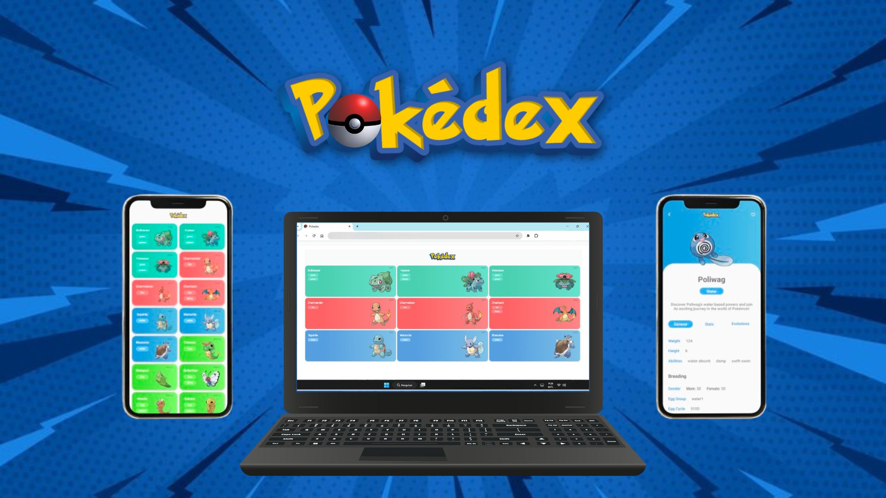

# ⚡️ Pokedex
 

> Parte do projeto Bootcamp full-stack Angular + Java da [DIO](https://web.dio.me/) 

## 👩‍💻 O projeto

    O projeto consiste em simular uma pokedex de Pokémon. Todos os dados são chamados através da Pokeapi.

## 🛠️ Tecnologias Utilizadas

- HTML
- CSS
- JavaScript Vanilla
- [PokéAPI](https://pokeapi.co/)

## 🗂️ Visão Geral das Classes

O projeto inclui as seguintes classes:

- **class-pokemon.js**: Define a estrutura e os métodos para objetos Pokémon.
- **main.js**: Gerencia a lógica principal da aplicação e a navegação.
- **poke-api-profile.js**: Gerencia a busca e renderização de dados do perfil dos Pokémon.
- **poke-api.js**: Contém funções para interagir com a PokéAPI.
- **pokemon-profile.js**: Exibe informações detalhadas sobre um Pokémon selecionado.

## 📂 Estrutura do Projeto

js-pokedex                    
├─ assets                     
│  ├─ css                     
│  │  ├─ colors.css           
│  │  ├─ global.css           
│  │  ├─ pokedex.css          
│  │  └─ profile.css          
│  ├─ images                  
│  │  ├─ banner.jpg           
│  │  ├─ favicon-32x32.png    
│  │  └─ logo.png             
│  └─ js                      
│     ├─ class-pokemon.js     
│     ├─ main.js              
│     ├─ poke-api-profile.js  
│     ├─ poke-api.js          
│     └─ pokemon-profile.js   
├─ index.html                 
├─ pokemon-profile.html       
└─ README.md

